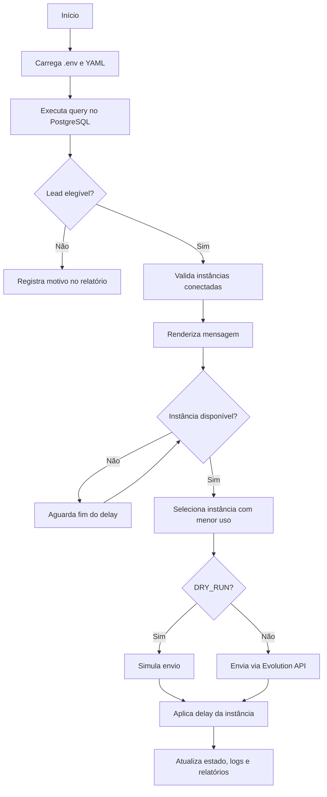

# postgres-lead-whatsapp-dispatcher

Dispatcher em Python para consultar leads no PostgreSQL, aplicar regras de elegibilidade comercial e distribuir mensagens entre instâncias de WhatsApp usando Evolution Go/Evolution API.

O projeto demonstra uma automação operacional comum em times comerciais: selecionar contatos elegíveis por SQL, montar mensagens personalizadas, respeitar limites por instância e registrar a execução com logs e relatórios.

> A integração usa Evolution Go/Evolution API, uma API não oficial para WhatsApp. O uso real exige opt-in/base legal, controle de volume, política de opt-out e atenção à LGPD.

## Visão geral

O fluxo foi pensado para uma operação de ensino superior EAD, onde leads deixam interesse em um curso e precisam receber uma abordagem inicial ou de continuidade. Antes de qualquer envio, o dispatcher consulta a base, remove contatos que não devem receber mensagem e decide qual instância está disponível.

Na prática, o sistema:

1. Lê configurações via `.env` e arquivos YAML.
2. Executa uma query SQL externa no PostgreSQL.
3. Valida telefone, opt-in e status comercial do lead.
4. Confere se as instâncias configuradas estão conectadas.
5. Renderiza uma mensagem com saudação e placeholders.
6. Escolhe uma instância disponível de WhatsApp.
7. Simula ou envia a mensagem conforme `DRY_RUN`.
8. Aplica delay individual por instância.
9. Gera logs e relatórios de execução.

## O que foi implementado

| Área | Entrega |
|---|---|
| Consulta de leads | Query SQL versionada como exemplo e configurável por `LEAD_QUERY_PATH`. |
| Elegibilidade | Filtros para telefone válido, opt-in, venda iniciada, matrícula e envio anterior. |
| Mensagens | Templates em YAML com variações, peso e placeholders por lead. |
| Instâncias | Pool de instâncias com `enabled`, delay, limite por execução e limite diário. |
| Distribuição | Seleção da instância disponível com menor volume na execução. |
| Segurança operacional | `DRY_RUN` ativo por padrão, mascaramento de telefone em logs e configs reais fora do git. |
| Relatórios | Resumo em `md`, `csv` ou `json`, CSV de enviados e CSV de falhas/não enviados. |
| Qualidade | Testes com `pytest`, lint com `ruff` e CI no GitHub Actions. |

## Ferramentas e tecnologias

- Python 3.11+
- PostgreSQL
- SQL externo para seleção de leads
- YAML para mensagens e instâncias
- Pydantic Settings para configuração por ambiente
- HTTPX para chamadas HTTP
- Evolution Go/Evolution API para envio via WhatsApp
- pytest para testes automatizados
- ruff para lint
- GitHub Actions para CI
- Gitleaks para varredura de segredos no pipeline

## Fluxo de funcionamento



## Distribuição entre instâncias

Cada instância tem seu próprio delay e seus próprios limites. Isso evita bloquear toda a execução quando apenas uma instância acabou de enviar.

Exemplo:

```txt
caixa-01 envia mensagem e entra em delay de 87 segundos
caixa-02 continua livre e pode enviar outro lead
caixa-03 continua livre e pode enviar outro lead
```

A próxima mensagem vai para uma instância livre, priorizando a que tem menor quantidade de envios na execução. Se todas estiverem em delay, o processo aguarda a próxima disponibilidade. Se todas atingirem limite, o comportamento depende de `DISPATCH_LIMIT_OVERRIDE`.

## Configuração

O repositório versiona apenas arquivos de exemplo. Os arquivos reais devem ficar fora do git:

```txt
.env
config/instances.yml
config/messages.yml
config/lead_query.sql
config/setup_postgres_hdd.sql
data/leads_mock.csv
data/dispatch_state.json
logs/*
reports/*
```

Crie os arquivos locais a partir dos exemplos:

```bash
cp .env.example .env
cp config/instances.example.yml config/instances.yml
cp config/messages.example.yml config/messages.yml
cp config/lead_query.example.sql config/lead_query.sql
```

Exemplo de variáveis principais:

```env
POSTGRES_HOST=localhost
POSTGRES_PORT=5432
POSTGRES_DB=postgres_hdd
POSTGRES_USER=postgres
POSTGRES_PASSWORD=change_me
POSTGRES_SSLMODE=prefer

LEAD_QUERY_PATH=config/lead_query.sql
LEAD_LIMIT=100

EVOLUTION_BASE_URL=http://localhost:8080
EVOLUTION_API_KEY=change_me
EVOLUTION_SEND_TEXT_PATH=/message/sendText/{instance}
EVOLUTION_INSTANCE_STATUS_PATH=/instance/status
EVOLUTION_CONNECTED_STATES=open,connected,online

INSTANCES_CONFIG_PATH=config/instances.yml
MESSAGES_CONFIG_PATH=config/messages.yml

DRY_RUN=true
DEFAULT_COUNTRY_CODE=55
REQUEST_TIMEOUT_SECONDS=30
MAX_RETRIES=3
STOP_ON_CRITICAL_ERROR=false
DISPATCH_LIMIT_OVERRIDE=ask
LIMIT_OVERRIDE_PROMPT_TIMEOUT_SECONDS=120
DISPATCH_STATE_PATH=data/dispatch_state.json

LOG_DIR=logs
LOG_RETENTION_DAYS=7
LOG_MASK_PHONE=true

REPORT_DIR=reports
REPORT_FORMATS=md
REPORT_KEEP_HISTORY=false
REPORT_SEND_WHATSAPP=false
```

`DISPATCH_LIMIT_OVERRIDE` aceita `ask`, `always` ou `never`. Com `ask`, se todas as instâncias atingirem `run_limit` ou `daily_limit`, o sistema pergunta no terminal por até 120 segundos se deve continuar ultrapassando os limites apenas naquela execução.

`LEAD_LIMIT` limita a quantidade de mensagens enviadas na execução. A query em `LEAD_QUERY_PATH` deve buscar os leads elegíveis; o dispatcher decide quantos enviar.

O controle diário fica em `DISPATCH_STATE_PATH` e armazena somente contadores por instância, sem dados pessoais.

`REPORT_FORMATS` aceita `md`, `csv` ou `json`, mas o dispatcher gera apenas um relatório principal por execução. Além do relatório principal, o sistema gera `sent_contacts_*.csv` com `lead_id`, telefone e instância dos envios, e `failed_contacts_*.csv` com falhas e não enviados.

Exemplo de instâncias:

```yml
instances:
  - name: sua-instancia-principal
    enabled: true
    min_delay_seconds: 45
    max_delay_seconds: 120
    run_limit: 100
    daily_limit: 300
    report_enabled: true

  - name: sua-instancia-secundaria
    enabled: true
    min_delay_seconds: 60
    max_delay_seconds: 150
    run_limit: 100
    daily_limit: 300
    report_enabled: false
```

Exemplo de template de mensagem:

```yml
greeting_variations:
  - Oi
  - Olá
  - Bom dia
  - Boa tarde

messages:
  - id: ead_continuidade_01
    enabled: true
    weight: 1
    text: |
      {greeting}, {first_name}. Tudo bem?

      Vi que você demonstrou interesse no curso de {course_interest}, com duração aproximada de {duration_interest}.

      Estou entrando em contato para saber se você precisa de ajuda para dar continuidade na sua inscrição.
```

## Exemplo de log

O trecho abaixo mostra uma execução em `DRY_RUN`, com telefones mascarados, instâncias conectadas, distribuição dos leads, delay, skips de elegibilidade e geração de relatórios.

```txt
2026-05-02 10:00:00 | INFO | lead_dispatcher.main | Starting dispatcher app=postgres-lead-whatsapp-dispatcher dry_run=true
2026-05-02 10:00:00 | INFO | lead_dispatcher.config | Loaded instances config path=config/instances.yml enabled_instances=3
2026-05-02 10:00:00 | INFO | lead_dispatcher.config | Loaded messages config path=config/messages.yml enabled_templates=5 greeting_variations=7
2026-05-02 10:00:01 | INFO | lead_dispatcher.database | Connected to PostgreSQL host=localhost port=5432 db=postgres_hdd sslmode=prefer
2026-05-02 10:00:02 | INFO | lead_dispatcher.repository | Leads fetched total=15
2026-05-02 10:00:02 | INFO | lead_dispatcher.dispatcher | Dispatch plan leads_loaded=15 lead_limit=100 enabled_instances=3 instances=caixa-01,caixa-02,caixa-03 planned_sends=15 estimated_duration=6m52s
2026-05-02 10:00:02 | INFO | lead_dispatcher.dispatcher | Evolution instance connected instance=caixa-01 state=connected
2026-05-02 10:00:02 | INFO | lead_dispatcher.dispatcher | Lead eligible lead_id=1 phone=5541*******21
2026-05-02 10:00:02 | INFO | lead_dispatcher.dispatcher | Rendered message lead_id=1 template=ead_continuidade_01 phone=5541*******21
2026-05-02 10:00:02 | INFO | lead_dispatcher.dispatcher | Dry-run enabled; message not sent lead_id=1 instance=caixa-01 phone=5541*******21
2026-05-02 10:00:02 | INFO | lead_dispatcher.dispatcher | Dispatch progress lead_id=1 phone=5541*******21 total_progress=1/100 instance=caixa-01 instance_progress=1/100
2026-05-02 10:00:05 | INFO | lead_dispatcher.dispatcher | Instance in delay instance=caixa-03 wait_seconds=60 available_at=2026-05-02 10:01:05
2026-05-02 10:01:06 | INFO | lead_dispatcher.dispatcher | Lead skipped lead_id=8 phone=5541*******21 reason=sale_started
2026-05-02 10:01:07 | INFO | lead_dispatcher.dispatcher | Lead skipped lead_id=11 phone=5541*******21 reason=missing_whatsapp_opt_in
2026-05-02 10:03:21 | INFO | lead_dispatcher.dispatcher | Reports generated md=reports/send_report_2026-05-02_100321.md sent_contacts_csv=reports/sent_contacts_2026-05-02_100321.csv
2026-05-02 10:03:21 | INFO | lead_dispatcher.main | Dispatcher finished
```

## Instalação e execução

```bash
python -m venv .venv
source .venv/bin/activate
pip install -r requirements.txt
```

No Windows:

```bash
.venv\Scripts\activate
pip install -r requirements.txt
```

Para rodar em modo simulação:

```bash
python -m lead_dispatcher.main
```

Para envio real, configure PostgreSQL, Evolution API, instâncias e mensagens, revise a query de elegibilidade e altere:

```env
DRY_RUN=false
```

## Estrutura do projeto

```txt
postgres-lead-whatsapp-dispatcher/
├─ config/
│  ├─ instances.example.yml
│  ├─ messages.example.yml
│  └─ lead_query.example.sql
├─ src/
│  └─ lead_dispatcher/
│     ├─ settings.py
│     ├─ database.py
│     ├─ lead_repository.py
│     ├─ eligibility.py
│     ├─ instance_pool.py
│     ├─ message_renderer.py
│     ├─ evolution_client.py
│     ├─ dispatcher.py
│     ├─ reporting.py
│     └─ logging_config.py
├─ tests/
├─ .env.example
├─ COMPLIANCE.md
├─ pyproject.toml
└─ README.md
```

## Qualidade e segurança

```bash
ruff check .
pytest -q
```

O CI executa lint, testes e varredura de segredos. Antes de publicar ou compartilhar uma execução real, confira também:

- `.env`, configs reais e relatórios não estão versionados.
- `LOG_MASK_PHONE=true` está ativo quando houver dados reais.
- Relatórios em `reports/` podem conter dados operacionais e devem permanecer fora do git.
- A query contém apenas leads com opt-in/base legal e sem restrições comerciais.
- O uso da API não oficial está alinhado com os riscos e políticas da operação.

Este repositório é publicado como referência técnica. Não há processo aberto de contribuição.

## Licença

Distribuído sob a licença Apache 2.0. Consulte [LICENSE](LICENSE).
