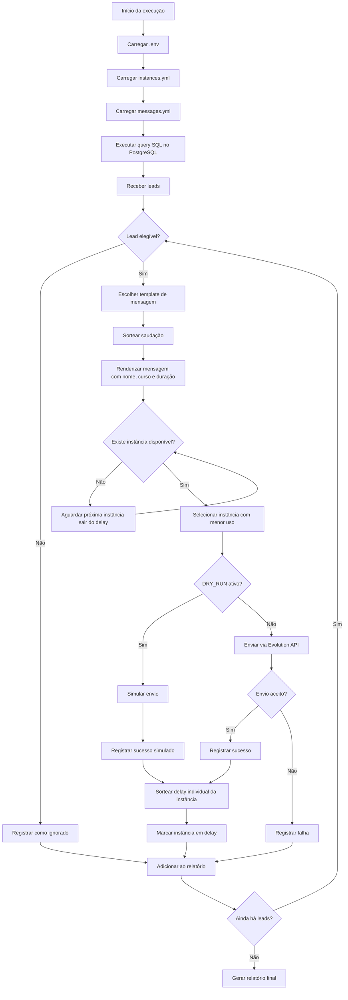

# postgres-lead-whatsapp-dispatcher

Script Python modular para consultar leads no PostgreSQL, validar status comercial e distribuir envios via Evolution Go/Evolution API.

## Valor central

Este projeto automatiza o envio controlado de mensagens para leads interessados em cursos de ensino superior, evitando contato com pessoas que já tiveram venda iniciada, matrícula realizada ou que não estejam elegíveis para contato.

O foco é criar uma base simples, configurável e reutilizável para operações comerciais que precisam consultar uma base PostgreSQL, montar mensagens personalizadas e distribuir disparos entre múltiplas instâncias de WhatsApp.

## Caso de uso real

Uma instituição de ensino possui uma vitrine de inscrições para cursos de ensino superior EAD. O lead informa dados como nome, telefone, curso de interesse e duração aproximada do curso.

Antes de enviar uma mensagem, o sistema:

1. Consulta os leads no PostgreSQL.
2. Filtra quem ainda não iniciou venda ou matrícula.
3. Valida telefone, opt-in e elegibilidade.
4. Escolhe uma variação de mensagem.
5. Preenche nome, curso e duração de interesse.
6. Seleciona uma instância disponível.
7. Envia ou simula o envio, conforme `DRY_RUN`.
8. Aplica delay aleatório individual na instância usada.
9. Gera logs e relatório de execução.

## Funcionalidades

| Funcionalidade | Descrição |
|---|---|
| Consulta PostgreSQL | Banco configurável via `.env`, incluindo host, porta, banco, usuário, senha e SSL mode. |
| Query customizável | A query de leads fica em arquivo SQL externo, configurado por `LEAD_QUERY_PATH`. |
| Mensagem customizável | Templates ficam em `config/messages.yml`, com variações e placeholders. |
| Saudação aleatória | Permite alternar automaticamente entre `Oi`, `Olá`, `Oi!`, `Bom dia`, `Boa tarde`, entre outras. |
| Personalização por lead | Suporta placeholders como `{first_name}`, `{course_interest}` e `{duration_interest}`. |
| Múltiplas instâncias | Instâncias de WhatsApp configuradas por YAML em `config/instances.yml`. |
| Distribuição tipo round-robin | O sistema usa a próxima instância disponível e evita instâncias em delay. |
| Delay individual | Cada instância recebe um delay aleatório próprio após cada disparo. |
| Paralelismo operacional | Se uma instância estiver em delay, outra disponível pode continuar enviando. |
| Dry-run | Permite simular envios sem chamar a API real. |
| Logs rotativos | Logs salvos em `logs/` com retenção automática. |
| Relatórios | Gera um relatório agregado no formato definido por `REPORT_FORMATS`, sem telefones ou linhas por lead. |
| Bases operacionais | Gera CSV separado de enviados e CSV separado de falhas/não enviados. |
| Envio de relatório | Envia resumo final para um destinatário via WhatsApp quando habilitado. |
| Projeto no GitHub | Este projeto foi usado para documentar e versionar o dispatcher no GitHub. Repositório: [Anotther/postgres-lead-whatsapp-dispatcher](https://github.com/Anotther/postgres-lead-whatsapp-dispatcher). |

## Como funciona a distribuição entre instâncias

A distribuição não é um loop simples com um único delay global. Cada instância tem seu próprio controle de disponibilidade.

Exemplo:

```txt
caixa-01 envia mensagem e entra em delay de 87 segundos
caixa-02 continua livre e pode enviar outro lead
caixa-03 continua livre e pode enviar outro lead
```

O comportamento esperado é:

1. O sistema verifica quais instâncias estão habilitadas.
2. Remove temporariamente as instâncias que ainda estão em delay.
3. Entre as disponíveis, escolhe a que tem menor volume de envios na execução.
4. Envia a mensagem.
5. Sorteia um delay entre `min_delay_seconds` e `max_delay_seconds` daquela instância.
6. Marca essa instância como indisponível até o fim do delay.
7. Continua usando as outras instâncias disponíveis.

Isso cria um comportamento de round-robin operacional por disponibilidade: a próxima mensagem vai para uma instância livre, mantendo distribuição equilibrada sem travar todas as caixas por causa do delay de uma única instância.

## Diagrama de funcionamento



## Exemplo de configuração de instâncias

Arquivo:

```txt
config/instances.yml
```

Exemplo:

```yml
instances:
  - name: caixa-01
    enabled: true
    min_delay_seconds: 45
    max_delay_seconds: 120
    run_limit: 100
    daily_limit: 300
    report_enabled: true

  - name: caixa-02
    enabled: true
    min_delay_seconds: 60
    max_delay_seconds: 150
    run_limit: 100
    daily_limit: 300
    report_enabled: false
```

Neste exemplo, `caixa-01` e `caixa-02` podem enviar mensagens independentemente. Se `caixa-01` enviar e entrar em delay, `caixa-02` ainda pode continuar enviando.

## Exemplo de mensagem customizável

Arquivo:

```txt
config/messages.yml
```

Exemplo:

```yml
greeting_variations:
  - Oi
  - Olá
  - Oi!
  - Olá!
  - Bom dia
  - Boa tarde
  - Boa noite

messages:
  - id: ead_continuidade_01
    enabled: true
    weight: 1
    text: |
      {greeting}, {first_name}. Tudo bem?

      Vi que você demonstrou interesse no curso de {course_interest}, com duração aproximada de {duration_interest}.

      Estou entrando em contato para saber se você precisa de ajuda para dar continuidade na sua inscrição.
```

Exemplo renderizado:

```txt
Olá, Ana. Tudo bem?

Vi que você demonstrou interesse no curso de Administração, com duração aproximada de 4 anos.

Estou entrando em contato para saber se você precisa de ajuda para dar continuidade na sua inscrição.
```

## Configuração via `.env`

O banco de dados, API, caminhos de configuração, logs e relatórios são controlados por variáveis de ambiente.

Exemplo:

```env
POSTGRES_HOST=localhost
POSTGRES_PORT=5432
POSTGRES_DB=postgres_hdd
POSTGRES_USER=postgres
POSTGRES_PASSWORD=change_me
POSTGRES_SSLMODE=prefer

LEAD_QUERY_PATH=config/lead_query.sql
LEAD_LIMIT=100

EVOLUTION_BASE_URL=http://localhost:8080
EVOLUTION_API_KEY=change_me
EVOLUTION_SEND_TEXT_PATH=/message/sendText/{instance}
EVOLUTION_INSTANCE_STATUS_PATH=/instance/status
EVOLUTION_CONNECTED_STATES=open,connected,online

INSTANCES_CONFIG_PATH=config/instances.yml
MESSAGES_CONFIG_PATH=config/messages.yml

DRY_RUN=true
DEFAULT_COUNTRY_CODE=55
REQUEST_TIMEOUT_SECONDS=30
MAX_RETRIES=3
STOP_ON_CRITICAL_ERROR=false
DISPATCH_LIMIT_OVERRIDE=ask
LIMIT_OVERRIDE_PROMPT_TIMEOUT_SECONDS=120
DISPATCH_STATE_PATH=data/dispatch_state.json

LOG_DIR=logs
LOG_RETENTION_DAYS=7
LOG_MASK_PHONE=true

REPORT_DIR=reports
REPORT_FORMATS=md
REPORT_KEEP_HISTORY=false
REPORT_SEND_WHATSAPP=false
REPORT_RECIPIENT_NUMBER=5599999999999
REPORT_RECIPIENT_INSTANCE=sua-instancia-principal
```

`DISPATCH_LIMIT_OVERRIDE` aceita `ask`, `always` ou `never`. Com `ask`, se todas as instâncias atingirem `run_limit` ou `daily_limit`, o sistema pergunta no terminal por até 120 segundos se deve continuar ultrapassando os limites apenas naquela execução.

`LEAD_LIMIT` limita a quantidade de mensagens enviadas na execução. A query em `LEAD_QUERY_PATH` deve buscar todos os leads elegíveis sem `LIMIT`; o dispatcher decide quantos enviar.

O controle diário fica em `DISPATCH_STATE_PATH` e armazena somente contadores por instância, sem dados pessoais.

`REPORT_FORMATS` aceita `md`, `csv` ou `json`, mas o dispatcher gera apenas um relatório principal por execução. Com `REPORT_KEEP_HISTORY=false`, relatórios antigos em `reports/` são apagados antes de salvar a nova execução. Além do relatório principal, o sistema gera `sent_contacts_*.csv` com `lead_id`, telefone e instância dos envios, e `failed_contacts_*.csv` com falhas e não enviados.

## Setup local com Postgres HDD

O repositório mantém apenas exemplos versionados. Os arquivos reais abaixo ficam no `.gitignore`:

```txt
.env
config/instances.yml
config/messages.yml
config/lead_query.sql
config/setup_postgres_hdd.sql
data/leads_mock.csv
data/dispatch_state.json
logs/*
reports/*
```

Nesta branch, foi criado um `.env` local apontando para `POSTGRES_DB=postgres_hdd`, com `DRY_RUN=true` e `LOG_MASK_PHONE=true`. Preencha `POSTGRES_USER`, `POSTGRES_PASSWORD`, `EVOLUTION_API_KEY` e o nome real da instância antes de usar.

Para criar e popular o banco local com o mock:

```bash
make postgres-hdd-setup
```

O mock local usa `41995306821` em todos os contatos para evitar disparo acidental para números reais durante testes.

## Exemplo de mensagem enviada no WhatsApp

```txt
Olá, Ana. Tudo bem?

Vi que você demonstrou interesse no curso de Administração, com duração aproximada de 4 anos.

Estou entrando em contato para saber se você precisa de ajuda para dar continuidade na sua inscrição.
```

## Exemplo de log de execução

Este é um exemplo de como o sistema deve se comportar quando estiver funcionando:

```txt
2026-05-02 10:00:00 | INFO | lead_dispatcher.main | Starting dispatcher app=postgres-lead-whatsapp-dispatcher dry_run=true
2026-05-02 10:00:00 | INFO | lead_dispatcher.config | Loaded instances config path=config/instances.yml enabled_instances=3
2026-05-02 10:00:00 | INFO | lead_dispatcher.config | Loaded messages config path=config/messages.yml enabled_templates=5 greeting_variations=7
2026-05-02 10:00:01 | INFO | lead_dispatcher.database | Connected to PostgreSQL host=localhost port=5432 db=postgres_hdd sslmode=prefer
2026-05-02 10:00:01 | INFO | lead_dispatcher.repository | Fetching leads query_path=config/lead_query.sql
2026-05-02 10:00:02 | INFO | lead_dispatcher.repository | Leads fetched total=15
2026-05-02 10:00:02 | INFO | lead_dispatcher.dispatcher | Dispatch plan leads_loaded=15 lead_limit=100 enabled_instances=3 instances=caixa-01,caixa-02,caixa-03 planned_sends=15 estimated_duration=6m52s
2026-05-02 10:00:02 | INFO | lead_dispatcher.dispatcher | Evolution instance connected instance=caixa-01 state=connected
2026-05-02 10:00:02 | INFO | lead_dispatcher.dispatcher | Evolution instance connected instance=caixa-02 state=connected
2026-05-02 10:00:02 | INFO | lead_dispatcher.dispatcher | Evolution instance connected instance=caixa-03 state=connected
2026-05-02 10:00:02 | INFO | lead_dispatcher.dispatcher | Lead eligible lead_id=1 phone=5541*******21
2026-05-02 10:00:02 | INFO | lead_dispatcher.dispatcher | Rendered message lead_id=1 template=ead_continuidade_01 phone=5541*******21
2026-05-02 10:00:02 | INFO | lead_dispatcher.dispatcher | Dry-run enabled; message not sent lead_id=1 instance=caixa-01 phone=5541*******21
2026-05-02 10:00:02 | INFO | lead_dispatcher.dispatcher | Dispatch progress lead_id=1 phone=5541*******21 total_progress=1/100 instance=caixa-01 instance_progress=1/100
2026-05-02 10:00:03 | INFO | lead_dispatcher.dispatcher | Lead eligible lead_id=2 phone=5541*******21
2026-05-02 10:00:03 | INFO | lead_dispatcher.dispatcher | Rendered message lead_id=2 template=ead_continuidade_03 phone=5541*******21
2026-05-02 10:00:03 | INFO | lead_dispatcher.dispatcher | Dry-run enabled; message not sent lead_id=2 instance=caixa-02 phone=5541*******21
2026-05-02 10:00:03 | INFO | lead_dispatcher.dispatcher | Dispatch progress lead_id=2 phone=5541*******21 total_progress=2/100 instance=caixa-02 instance_progress=1/100
2026-05-02 10:00:04 | INFO | lead_dispatcher.dispatcher | Lead eligible lead_id=3 phone=5541*******21
2026-05-02 10:00:04 | INFO | lead_dispatcher.dispatcher | Rendered message lead_id=3 template=ead_continuidade_02 phone=5541*******21
2026-05-02 10:00:04 | INFO | lead_dispatcher.dispatcher | Dry-run enabled; message not sent lead_id=3 instance=caixa-03 phone=5541*******21
2026-05-02 10:00:04 | INFO | lead_dispatcher.dispatcher | Dispatch progress lead_id=3 phone=5541*******21 total_progress=3/100 instance=caixa-03 instance_progress=1/100
2026-05-02 10:00:05 | INFO | lead_dispatcher.dispatcher | Instance in delay instance=caixa-03 wait_seconds=60 available_at=2026-05-02 10:01:05
2026-05-02 10:01:06 | INFO | lead_dispatcher.dispatcher | Lead skipped lead_id=8 phone=5541*******21 reason=sale_started
2026-05-02 10:01:07 | INFO | lead_dispatcher.dispatcher | Lead skipped lead_id=11 phone=5541*******21 reason=missing_whatsapp_opt_in
2026-05-02 10:03:21 | INFO | lead_dispatcher.dispatcher | Reports generated md=reports/send_report_2026-05-02_100321.md sent_contacts_csv=reports/sent_contacts_2026-05-02_100321.csv
2026-05-02 10:03:21 | INFO | lead_dispatcher.main | Dispatcher finished
```

## Estrutura esperada

```txt
postgres-lead-whatsapp-dispatcher/
├─ config/
│  ├─ instances.example.yml
│  ├─ messages.example.yml
│  └─ lead_query.example.sql
├─ data/
│  └─ .gitkeep
├─ logs/
│  └─ .gitkeep
├─ reports/
│  └─ .gitkeep
├─ src/
│  └─ lead_dispatcher/
│     ├─ settings.py
│     ├─ database.py
│     ├─ lead_repository.py
│     ├─ eligibility.py
│     ├─ instance_pool.py
│     ├─ message_renderer.py
│     ├─ evolution_client.py
│     ├─ dispatcher.py
│     ├─ reporting.py
│     ├─ logging_config.py
│     └─ utils.py
├─ .env.example
├─ .gitignore
├─ pyproject.toml
├─ requirements.txt
└─ README.md
```

## Instalação rápida

```bash
python -m venv .venv
source .venv/bin/activate
pip install -r requirements.txt
```

No Windows:

```bash
.venv\Scripts\activate
pip install -r requirements.txt
```

## Uso planejado

Copie os arquivos de exemplo:

```bash
cp .env.example .env
cp config/instances.example.yml config/instances.yml
cp config/messages.example.yml config/messages.yml
cp config/lead_query.example.sql config/lead_query.sql
```

Nesta branch os arquivos locais já foram criados para facilitar a configuração, mas continuam ignorados pelo Git.

Rode em modo simulação:

```bash
python -m lead_dispatcher.main
```

Para envio real, configure corretamente a Evolution API e defina:

```env
DRY_RUN=false
```

## Limitações e cuidados

Este projeto não deve ser usado para spam, disparos abusivos ou contato sem base legal.

Antes de usar em produção, valide:

- Consentimento ou base legal para contato.
- Política de opt-out.
- Higiene da base.
- Limites operacionais por instância.
- Riscos do uso de APIs não oficiais.
- Conformidade com LGPD.

## Licença recomendada

Recomendação: Apache License 2.0

Motivo: este projeto tem potencial de uso comercial e integração sensível com APIs e dados operacionais, então a Apache 2.0 oferece uma licença permissiva com termos mais completos.

Link oficial:
https://www.apache.org/licenses/LICENSE-2.0
